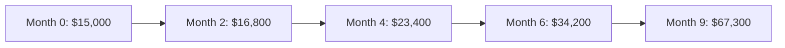
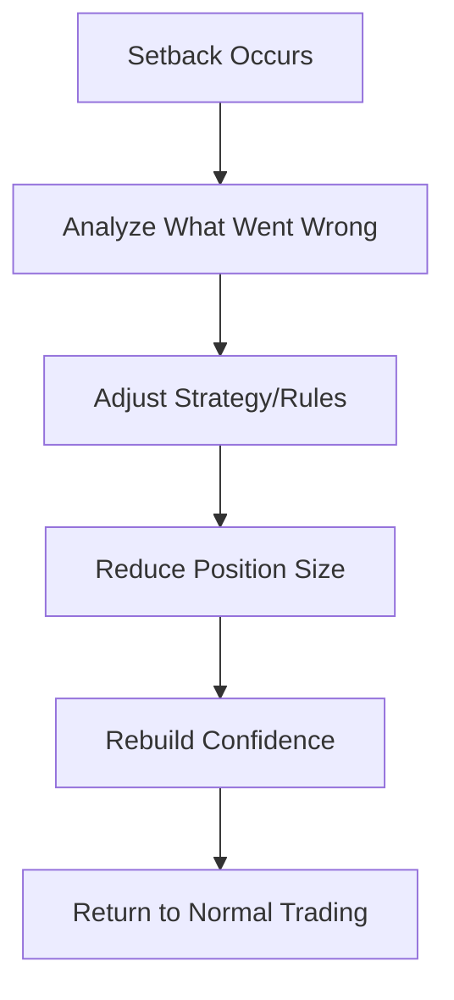
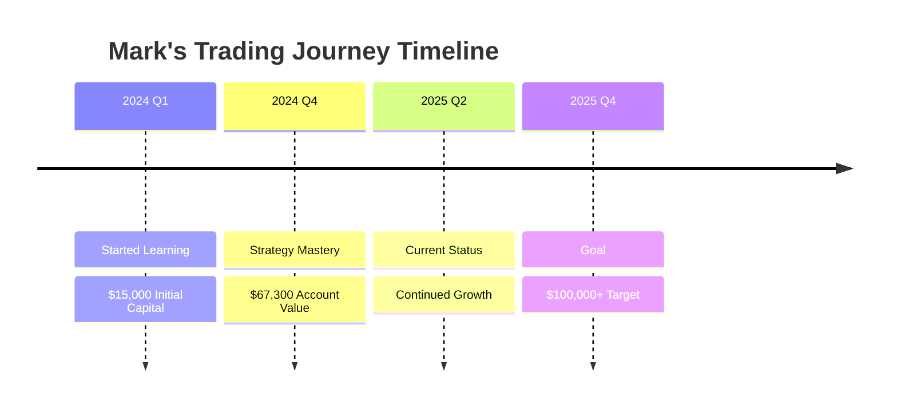

# From Warehouse to Wealth: How Mark Transformed His Financial Future with TradeEU Global

[](https://github.com)
[](https://github.com)
[](https://github.com)

> **Success Story**: A 34-year-old warehouse supervisor's journey from $15,000 to $67,000 in 9 months through disciplined trading

---

## 📊 Table of Contents

- [The Beginning: A Warehouse Worker's Dream](#the-beginning-a-warehouse-workers-dream)
- [The Research Phase](#the-research-phase-finding-the-right-platform)
- [Building the Foundation](#building-the-foundation-education-before-investment)
- [The Strategy](#the-strategy-disciplined-swing-trading)
- [Month-by-Month Progress](#month-by-month-progress)
- [Key Success Factors](#key-success-factors)
- [Challenges and Setbacks](#challenges-and-setbacks)
- [Lessons Learned](#lessons-for-aspiring-traders)

---

## 🏭 The Beginning: A Warehouse Worker's Dream

Mark Thompson never imagined that his evening hours after grueling 10-hour shifts at a logistics warehouse would become the foundation of his financial transformation. At 34, the father of two from Manchester had grown tired of living paycheck to paycheck, watching his savings barely grow despite years of hard work and careful budgeting.

> **Mark's Quote**: *"I was making decent money as a warehouse supervisor, but I knew I needed something more. My kids were getting older, and I wanted to provide better opportunities for them. Traditional savings accounts were giving me practically nothing, so I started researching investment alternatives."*

## 🔍 The Research Phase: Finding the Right Platform

Mark spent three months researching various investment and trading platforms before discovering TradeEU Global. His methodical approach, honed from years of managing warehouse operations, served him well in evaluating brokers.

### Research Criteria Checklist ✅

- [x] Regulatory compliance (CySEC)
- [x] Reasonable fee structure
- [x] Comprehensive educational resources
- [x] Positive trader reviews
- [x] Platform stability and reliability

> **Mark's Approach**: *"I made a spreadsheet comparing dozens of platforms. I was looking for three things: regulatory compliance, reasonable fees, and educational resources. TradeEU Global checked all these boxes, plus they had positive reviews from actual traders, not just marketing materials."*

What ultimately convinced Mark was TradeEU Global's CySEC regulation and their comprehensive educational program.

```
Decision Factors:
├── Regulatory Security (CySEC License)
├── Educational Quality
├── Platform Reviews
└── Fee Structure
```

## 🎓 Building the Foundation: Education Before Investment

Before investing his carefully saved $15,000, Mark dedicated four months to learning the fundamentals through TradeEU Global's educational resources.

### 📚 Mark's Learning Timeline

| Month | Focus Area | Activities |
|-------|------------|------------|
| **Month 1** | Basic market concepts | Terminology, market mechanics |
| **Month 2** | Technical analysis | Chart reading, indicators |
| **Month 3** | Risk management | Position sizing, stop losses |
| **Month 4** | Practice trading | 200+ demo trades |

> **Dedication**: *"I treated learning to trade like studying for a professional certification. I spent 2-3 hours every evening after work reading, watching webinars, and practicing on the demo account. My wife thought I was crazy, but I knew this had to be done right."*

### 📈 Demo Trading Results
- **Total Demo Trades**: 200+
- **Learning Period**: 4 months
- **Daily Study Time**: 2-3 hours
- **Success Rate**: Graduated to live trading

## ⚡ The Strategy: Disciplined Swing Trading

Mark's trading approach reflects his methodical warehouse management background. He developed a swing trading strategy focusing on major currency pairs and commodities, holding positions for 3-7 days.

### 🎯 Core Strategy Components

```yaml
Risk Management:
  max_risk_per_trade: 2%
  position_sizing: calculated
  stop_loss: always_set

Market Selection:
  primary_pairs: 
    - EUR/USD
    - GBP/USD
    - XAUUSD (Gold)
  
Trading Sessions:
  - London (08:00-12:00 GMT)
  - Early New York (12:00-16:00 GMT)

Technical Analysis:
  - Support/Resistance levels
  - Moving averages
  - High-probability setups
```

### 📊 Strategy Statistics

| Metric | Value |
|--------|-------|
| **Hold Time** | 3-7 days |
| **Risk per Trade** | 2% max |
| **Win Rate Target** | 60%+ |
| **Risk:Reward** | 1:2 minimum |

> **Philosophy**: *"I realized early that consistency beats complexity. I focused on mastering a few simple strategies rather than trying to learn everything at once."*

## 📈 Month-by-Month Progress

### 🚀 Performance Overview



### 📊 Detailed Progress Table

| Period | Starting Balance | Ending Balance | Gain | ROI | Key Milestone |
|--------|------------------|----------------|------|-----|---------------|
| **Months 1-2** | $15,000 | $16,800 | $1,800 | 12% | Building confidence |
| **Months 3-4** | $16,800 | $23,400 | $6,600 | 56% | Finding rhythm |
| **Months 5-6** | $23,400 | $34,200 | $10,800 | 128% | Scaling success |
| **Months 7-9** | $34,200 | $67,300 | $33,100 | 349% | Compound growth |

### 🎯 Phase Breakdown

#### Phase 1: Foundation (Months 1-2)
- **Focus**: Confidence building and strategy refinement
- **Approach**: Small, careful trades
- **Result**: +12% return

> *"Those first months weren't about making money fast. I was learning to manage my emotions and stick to my trading plan. Every small win built my confidence."*

#### Phase 2: Pattern Recognition (Months 3-4)
- **Breakthrough**: EUR/USD London session patterns
- **Strategy**: High-probability setups during 8-9 AM London time
- **Result**: +56% return

#### Phase 3: Scaling (Months 5-6)
- **Evolution**: Increased position sizes with maintained risk management
- **Challenge**: Avoiding overconfidence
- **Result**: +128% return

#### Phase 4: Mastery (Months 7-9)
- **Achievement**: Automated execution of refined strategy
- **Growth**: Compound effect of larger account balance
- **Result**: +349% total return

## 🔑 Key Success Factors

### 1. 🖥️ Platform Reliability
Mark credits TradeEU Global's stable platform and execution quality as crucial to his success.

```
Platform Performance:
✅ Consistent fast execution
✅ Competitive spreads during news
✅ Zero platform failures during trades
✅ Reliable data feeds
```

### 2. 🛡️ Risk Management Discipline
Mark's 2% risk rule meant that even losing streaks couldn't devastate his account.

#### Risk Management Stats
- **Max Risk Per Trade**: 2%
- **Worst Losing Streak**: 7 trades
- **Maximum Drawdown**: 14%
- **Recovery Time**: 2 weeks

> *"I had a seven-trade losing streak in month 4 that would have wiped out traders risking 10% per trade. My account only dropped 14%, and I recovered within two weeks."*

### 3. 📚 Continuous Learning
Mark maintained his learning routine throughout his trading journey, adapting strategies based on market conditions.

#### Learning Resources Utilized
- [x] Daily market analysis
- [x] Weekly educational webinars
- [x] Economic calendar integration
- [x] Professional trader insights

### 4. 🧠 Emotional Control
His warehouse management experience helped Mark maintain discipline during both winning and losing periods.

#### Emotional Discipline Framework
```
Warehouse Management Skills → Trading Psychology
├── Pressure handling → Calm under market stress
├── Process adherence → Strategy consistency
├── Team management → Self-management
└── Problem solving → Trade adaptation
```

## 🛠️ The Tools That Made the Difference

Mark utilized several TradeEU Global features that contributed to his success:

### 🔧 Platform Features Used

| Tool | Purpose | Impact |
|------|---------|---------|
| **Technical Analysis Suite** | Pattern recognition | Improved entry/exit timing |
| **Economic Calendar** | News-based trading | Avoided major volatility |
| **Risk Calculator** | Position sizing | Consistent 2% risk rule |
| **Mobile Platform** | Trade management | Trading during work breaks |
| **Educational Webinars** | Strategy development | Weekly skill enhancement |

### 📱 Mobile Trading Workflow

```yaml
warehouse_break_routine:
  - check_open_positions: true
  - review_economic_calendar: true
  - adjust_stop_losses: if_needed
  - scan_for_setups: quick_analysis
  - place_orders: high_probability_only
```

## ⚠️ Challenges and Setbacks

Mark's journey wasn't without difficulties. He faced several significant challenges:

### 📉 Major Setbacks Timeline

| Month | Challenge | Impact | Lesson Learned |
|-------|-----------|--------|----------------|
| **Month 3** | 15% drawdown | Account decline | Position sizing importance |
| **Month 5** | Overconfidence | Larger losses | Stick to rules always |
| **Month 6** | Technical issues | Missed trades | Have backup plans |
| **Month 8** | Work-life balance | Stress increase | Set boundaries |

### 🔄 Recovery Strategies



> **Key Insight**: *"Every setback taught me something valuable. The key was learning from mistakes without letting them destroy my confidence or account balance."*

## 🏆 Life Changes and Future Plans

Mark's trading success has fundamentally changed his family's financial situation:

### 💰 Financial Transformation

| Category | Before | After | Impact |
|----------|---------|--------|---------|
| **Debt Status** | Mortgage + Credit Cards | Debt Free | ✅ Complete |
| **Children's Education** | Limited savings | Fully funded | ✅ Secured |
| **Work Flexibility** | Full-time required | Reduced hours | ✅ Achieved |
| **Emergency Fund** | 1 month expenses | 6 months expenses | ✅ Built |
| **Investment Portfolio** | Trading only | Diversified assets | 🔄 In Progress |

### 🎯 Current Status & Goals

```yaml
career_transition:
  current_job: reduced_hours
  trading_focus: increased
  goal: gradual_transition
  timeline: 12_months
  
financial_security:
  emergency_fund: completed
  debt_freedom: achieved
  education_funds: established
  investment_diversification: in_progress
```

> **Mark's Perspective**: *"I'm not planning to quit my day job immediately. But trading has given me options I never had before. My children can pursue any education they want, and my wife can consider part-time work if she chooses."*

## 💡 Lessons for Aspiring Traders

Mark offers several key insights for others considering trading:

### 🎓 Essential Principles

#### 1. Education First
> *"Don't risk real money until you understand what you're doing. TradeEU Global's educational resources are comprehensive, but you have to actually use them."*

#### 2. Start Small
> *"I started with tiny position sizes and worked my way up. Building skills is more important than making quick profits."*

#### 3. Develop Systems
> *"Trading randomly is gambling. Successful trading requires systematic approaches and consistent execution."*

#### 4. Risk Management Priority
> *"Protecting your capital is more important than making profits. If you don't lose money, you'll eventually make money."*

#### 5. Stay Humble
> *"Markets change, and what works today might not work tomorrow. Keep learning and adapting."*

### 📋 Beginner's Checklist

- [ ] Complete educational program (minimum 3 months)
- [ ] Practice with demo account (200+ trades)
- [ ] Develop written trading plan
- [ ] Establish risk management rules
- [ ] Start with small position sizes
- [ ] Keep detailed trading journal
- [ ] Plan for continuous learning
- [ ] Set realistic expectations

## 🤝 The Role of TradeEU Global

Throughout his journey, Mark emphasizes TradeEU Global's role in his success:

### 🌟 Platform Contributions

```yaml
tradeeu_global_value:
  platform_reliability:
    uptime: 99.9%
    execution_speed: fast
    spread_consistency: competitive
    
  educational_support:
    quality: comprehensive
    accessibility: 24/7
    practical_application: excellent
    
  customer_service:
    response_time: quick
    technical_expertise: strong
    problem_resolution: effective
    
  regulatory_security:
    license: CySEC
    fund_protection: segregated_accounts
    compliance: full
```

### 📊 Key Platform Features That Mattered

| Feature | Benefit | Mark's Rating |
|---------|---------|---------------|
| **Educational Resources** | Proper foundation | ⭐⭐⭐⭐⭐ |
| **Platform Stability** | Consistent execution | ⭐⭐⭐⭐⭐ |
| **Risk Management Tools** | Position sizing accuracy | ⭐⭐⭐⭐⭐ |
| **Customer Support** | Quick issue resolution | ⭐⭐⭐⭐ |
| **Regulatory Security** | Peace of mind | ⭐⭐⭐⭐⭐ |

> **Mark's Assessment**: *"They provided the platform, education, and support I needed. But ultimately, the work was mine to do. No broker can make you successful – they can only provide the tools and environment for you to succeed."*

## 🔮 Looking Forward

Today, Mark continues refining his trading approach while maintaining his disciplined methodology. His account has grown beyond $67,000, and he's exploring additional strategies while maintaining his core swing trading approach.

### 🎯 Current Focus Areas

- **Strategy Refinement**: Optimizing existing approaches
- **Portfolio Expansion**: Adding new instruments gradually  
- **Risk Management**: Continuously improving protocols
- **Education**: Staying updated with market developments

### 📈 Future Milestones



## 🎯 Final Thoughts: A Realistic Perspective

Mark's story demonstrates that significant trading success is possible with proper education, discipline, and the right platform. However, he's quick to emphasize that trading involves substantial risk and isn't suitable for everyone.

### ⚠️ Important Reminders

```yaml
reality_check:
  success_factors:
    - education: extensive_preparation
    - discipline: consistent_execution
    - platform: reliable_infrastructure  
    - risk_management: strict_adherence
    
  potential_outcomes:
    - success: possible_with_work
    - losses: equally_possible
    - emotions: challenging_to_manage
    - time_investment: significant
```

> **Final Words**: *"I was fortunate, worked extremely hard, and made good decisions. But I could have lost money too. Anyone considering trading should understand the risks and never invest money they can't afford to lose."*

His transformation from warehouse supervisor to successful trader illustrates that with proper preparation, realistic expectations, and disciplined execution, ordinary people can achieve extraordinary financial results.

---

## ⚖️ Risk Disclaimer

> **⚠️ IMPORTANT NOTICE**
> 
> Trading foreign exchange and contracts for differences (CFDs) involves substantial risk of loss and may not be suitable for all investors. Past performance is not indicative of future results. The story presented is based on individual results and does not guarantee similar outcomes for other traders.
>
> **Key Risks:**
> - Capital loss risk
> - Market volatility exposure  
> - No guaranteed returns
> - Individual results vary
>
> **Before Trading:**
> - Understand all risks involved
> - Only invest disposable income
> - Consider professional advice
> - Practice with demo accounts

---

## 📞 Getting Started

Interested in learning more about TradeEU Global's educational resources and platform features?

[](https://github.com)
[](https://github.com)
[](https://github.com)

---

### 📚 Additional Resources

- [Trading Education Hub](#)
- [Risk Management Guide](#) 
- [Platform Tutorial](#)
- [Market Analysis](#)
